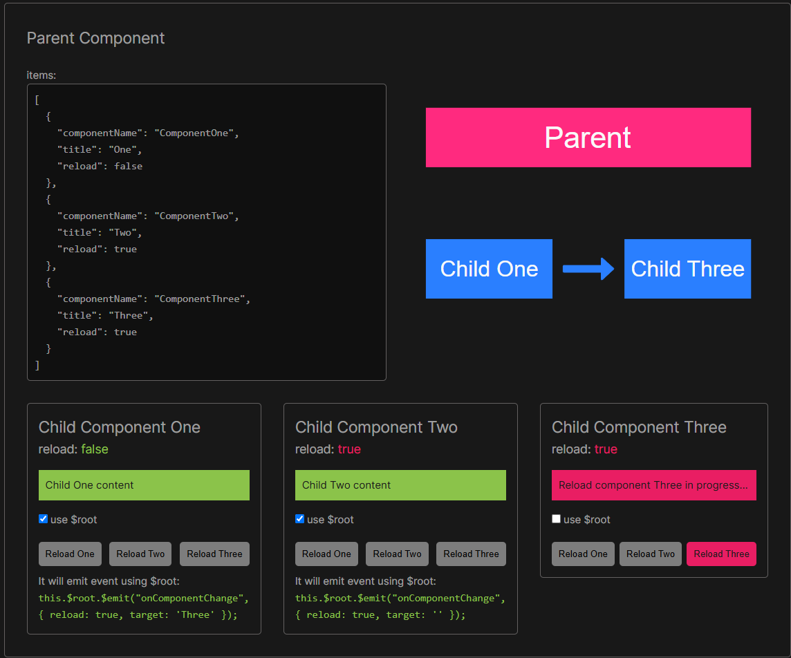

# How to Emit Data between Components in Vue

The Vue application is designed to demonstrate how to send events and props between sibling components without using Vuex. Two solutions are shown: one using event emission through the parent component and the other using root emit. The diagram illustrates the chosen method of communication between components.



The application has three components: **Child Component One**, **Child Component Two**, and **Child Component Three**. Each component has a `Reload` button that runs a method to emit an event to the parent component. The parent component updates the `reload` status of the target component in the `tabItems` array. The `reload` status of each component is used to trigger the reload of the component. The component will display a message _"Reload component `{{ title }}` in progress..."_ for 2 seconds before displaying the content of the component.

The application also has a `tabItems` array that contains the details of each component. The `tabItems` array is used to track the reload status of each component. When a component is reloaded, the `reload` property of the component is set to true. The `onComponentChange` event is emitted when the `Reload` button of a component is clicked. The `onComponentChange` event contains the `reload` status and the target component to reload. The `onComponentChange` event is handled in the parent component (`Home.vue`) to update the `reload` status of the target component in the `tabItems` array. The `reload` status of each component is used to trigger the reload of the component.

**Instructions:**

1. Click on the `Reload` button of any component to reload that component.
2. The component will reload and display a message _"Reload component `{{ title }}` in progress..."_ for 2 seconds.
3. After 2 seconds, the component will display the content of the component.

## Recommended IDE Setup

[VSCode](https://code.visualstudio.com/) + [Volar](https://marketplace.visualstudio.com/items?itemName=Vue.volar) (and disable Vetur) + [TypeScript Vue Plugin (Volar)](https://marketplace.visualstudio.com/items?itemName=Vue.vscode-typescript-vue-plugin).

## Customize configuration

See [Vite Configuration Reference](https://vitejs.dev/config/).

## Project Setup

```sh
# npm
npm install

# yarn
yarn
```

### Compile and Hot-Reload for Development

```sh
# npm
npm run dev

# yarn
yarn dev
```

### Compile and Minify for Production

```sh
# npm
npm run build

# yarn
yarn build
```
